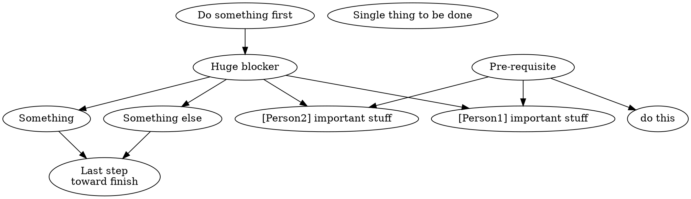
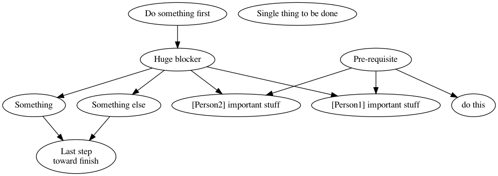

# notion-studies

This project is about me getting know [Notion](https://notion.so) HTTP API. The practical task is to visualize tasks
dependencies graph withing specific project.

## Concept

1. Fetch all tasks (__pages__) within specific project (__database__)
   via [Notion HTTP API](https://developers.notion.com/docs/getting-started)
1. Build dependency graph (I expect tasks to have "Depends on"/"Dependency for" properties of "relation" type).
1. Generate [graph in dot format](https://www.graphviz.org/doc/info/lang.html).
1. Render dependency graph via [graphviz](https://www.graphviz.org/about/) tool

## Configuration

There should be `config.json` file (will be ignored by git) with following content:

```json
{
  "notion_token": "secret_ABCDXXXYYYZZZ",
  "database_id": "123abc456efg"
}
```

## How to use it

`./main.py && open steps.png`

## Output example

Graph file is in dot format ([original file](assets/steps.dot)):



Example of rendered picture:


## External requirements

- [dot executable](https://www.graphviz.org/download/#executable-packages) - part of graphviz package

# Heroku app

For convenience there is a Heroku-compatible web application that could be deployed and accessible from web.

## App configuration
There should be few config variables set up:
- `BASIC_AUTH_PASSWORD` will be used to restrict access to app via basic auth.
- `BASIC_AUTH_USER` same as previous, will be used to restrict access to app via basic auth.
- `DATABASE_ID` will be used for tasks scrapping. See `notion_token` configuration key in previous sections of this README.
- `NOTION_TOKEN` will be used for tasks scrapping. See `database_id` configuration key in previous sections of this README.

## App deployment configuration
There should be the `heroku-community/apt` buildpack enabled. You could enable it in settings tab of Heroku dashboard: push button "Add buildback" and enter `heroku-community/apt`.

## Local development
Run following snippet and open http://localhost:8080
```bash
export BASIC_AUTH_USER=user
export BASIC_AUTH_PASSWORD=password
export DATABASE_ID=database_id
export NOTION_TOKEN=notion_token

python app.py
```
